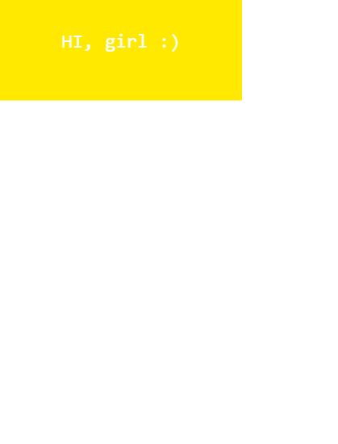

# **Random box react**

## **Desarrollo**

Para la creacion del random box se utilizo react.js react dom y jxs, a medida que se recarga la pagina, el texto cambia de fuente y el fondo cambia de color

Nuestra pagina se visualiza asi:

##  Tecnologias Usadas
- react
- javascript
- Html5
- JSX

## Autores

- **Wendy Quispe** - [@wendytamara](https://github.com/wendytamara)

## Licencia

Este proyecto está licenciado bajo la Licencia ISC - ver el archivo [LICENSE](https://www.isc.org) para más detalles.

Copyright &copy; 2018 All Rights Reserved.
